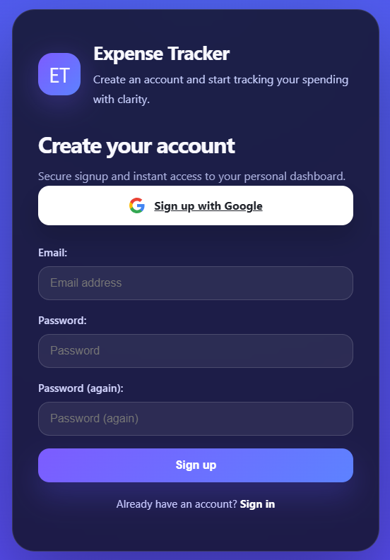
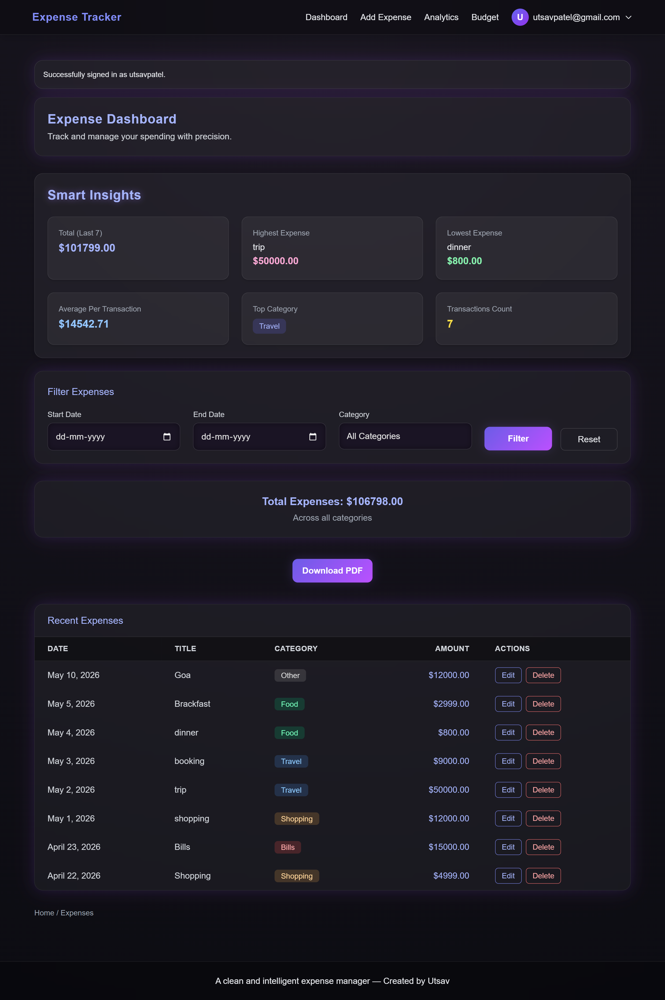
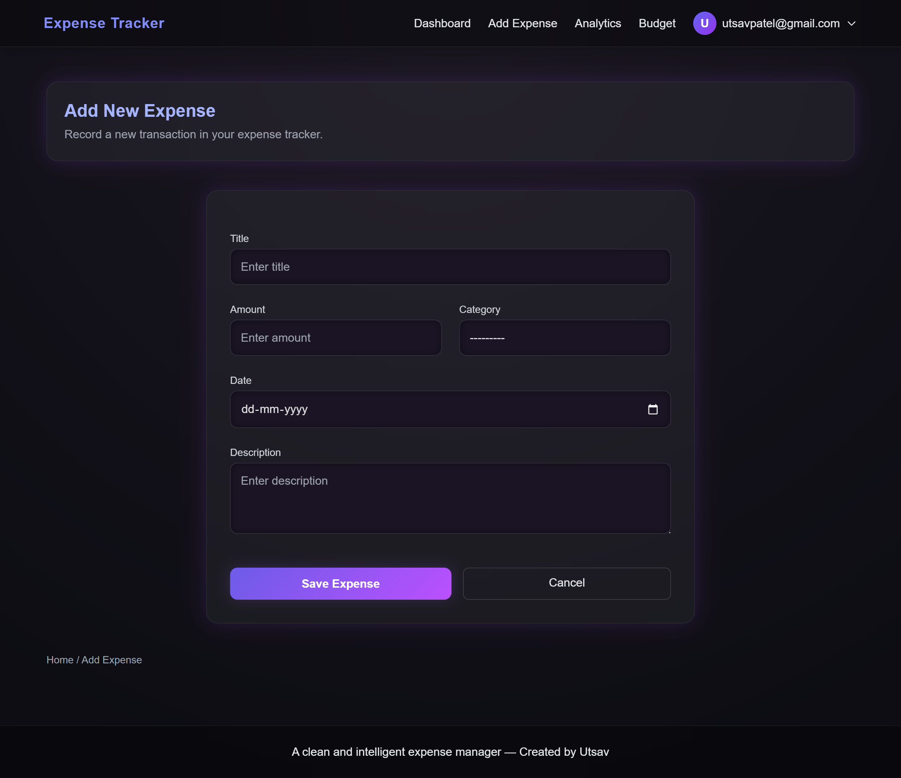
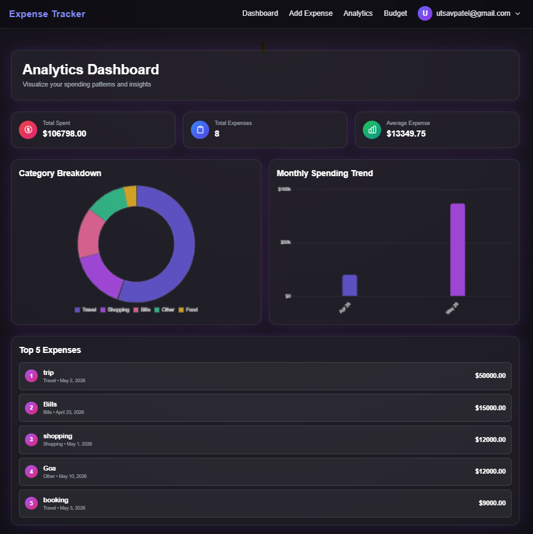
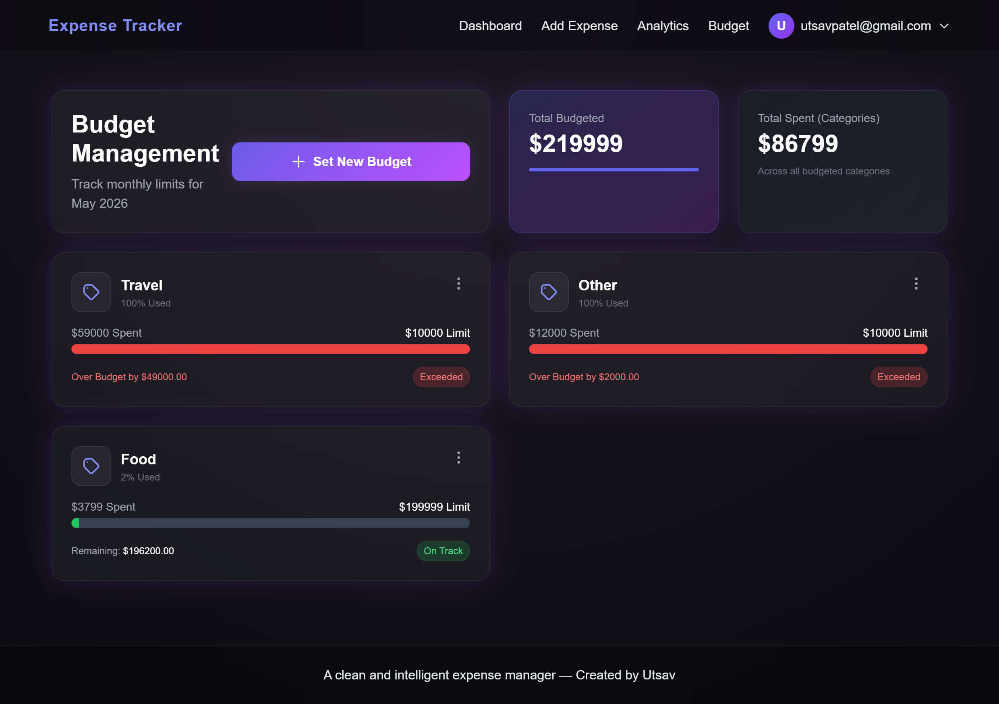

# 💸 Django Expense Tracker

A full-featured, production-ready **Personal Expense Tracker** web application built with Django. Track your daily expenses, set monthly budgets per category, visualize spending patterns with interactive analytics charts, and export reports to PDF — all secured with Google OAuth authentication.

---

## 🌐 Live Demo

> ⚡ **[View Live Project → https://utsavgangadiya.pythonanywhere.com/accounts/login/?next=/](https://utsavgangadiya.pythonanywhere.com/accounts/login/?next=/)**
>
> *(Available for a limited time — hosted on PythonAnywhere)*

---

## 📸 Screenshots

**Login Page**



---

**Sign Up Page**


---

**Expense Dashboard**



---

**Add New Expense**



---

**Analytics Dashboard**



---

**Budget Dashboard**



---

## ✨ Features

| Feature | Description |
|---|---|
| 🔐 Google OAuth Login | Sign in securely with your Google account via `django-allauth` |
| ➕ Expense Management | Add, edit, and delete expenses with category, date, amount & description |
| 📊 Analytics Dashboard | Interactive charts for monthly trends and category breakdowns |
| 💰 Budget Management | Set monthly per-category budgets with visual progress bars |
| 📄 PDF Export | Download all expenses as a formatted PDF report |
| 🔍 Filter & Search | Filter expenses by date range and category |
| 📈 Smart Insights | Last 7 transactions — total, highest, lowest, average |
| 👤 User Profiles | Per-user data isolation, avatar, bio, currency, and budget limit |
| 🛡️ Secure | `@login_required` guards on all views; user-scoped data queries |
| ⚙️ Admin Panel | Django admin for managing Expenses, Budgets & User Profiles |

---

## 🧱 Tech Stack

| Layer | Technology |
|---|---|
| **Backend** | Python 3.x, Django 4.2 |
| **Authentication** | django-allauth 65.x (Google OAuth 2.0) |
| **Database** | SQLite3 (development) |
| **Frontend** | HTML5, CSS3 (Vanilla), JavaScript |
| **PDF Generation** | xhtml2pdf, ReportLab |
| **Static Files (Prod)** | WhiteNoise |
| **Config Management** | python-decouple (`.env` file) |
| **Deployment** | PythonAnywhere (WSGI) |

---

## 📁 Project Structure

```
expense_tracker_project/
│
├── expense_project/               # Django project configuration
│   ├── settings.py                # All project settings (env-based)
│   ├── urls.py                    # Root URL configuration
│   ├── wsgi.py / asgi.py          # Entry points
│   └── templates/                 # Global templates
│       ├── base.html              # Base layout (navbar, styles)
│       ├── login.html             # Google OAuth login page
│       ├── account/               # Allauth account templates
│       └── socialaccount/         # Allauth social account templates
│
├── tracker/                       # Main Django app
│   ├── models.py                  # Expense, Budget, UserProfile models
│   ├── views.py                   # All view logic (CRUD + analytics + budget)
│   ├── forms.py                   # ExpenseForm, BudgetForm
│   ├── urls.py                    # App-level URL patterns
│   ├── admin.py                   # Django admin registrations
│   └── migrations/                # Database migration files
│
├── expense_project/templates/tracker/
│   ├── expense_list.html          # Main dashboard
│   ├── add_expense.html           # Add expense form
│   ├── edit_expense.html          # Edit expense form
│   ├── delete_expense.html        # Delete confirmation
│   ├── analytics.html             # Analytics with charts
│   ├── budget.html                # Budget overview
│   ├── budget_form.html           # Add/Edit budget form
│   └── pdf_template.html          # PDF export template
│
├── screenshots/                   # App screenshots for README
├── static/css/                    # Global stylesheets
├── manage.py
├── requirements.txt
├── .env                           # Local environment variables (not committed)
└── .env.example                   # Environment variable template
```

---

## 🗄️ Database Models

### `Expense`
| Field | Type | Description |
|---|---|---|
| `user` | ForeignKey(User) | Owner of the expense |
| `title` | CharField(100) | Short title/name |
| `amount` | DecimalField | Expense amount |
| `category` | CharField(choices) | Food, Travel, Shopping, Bills, Entertainment, Health, Education, Other |
| `date` | DateField | Date of expense |
| `description` | TextField | Optional notes |
| `created_at` / `updated_at` | DateTimeField | Auto-managed timestamps |

### `Budget`
| Field | Type | Description |
|---|---|---|
| `user` | ForeignKey(User) | Owner of the budget |
| `category` | CharField(choices) | Same as Expense categories |
| `amount` | DecimalField | Monthly budget limit |
| `month` | DateField | First day of the target month |

> **Unique constraint:** One budget per user, per category, per month.

**Computed methods:** `get_spent_amount()` · `get_remaining()` · `get_percentage_used()`

### `UserProfile`
| Field | Type | Description |
|---|---|---|
| `user` | OneToOneField(User) | Linked Django user |
| `avatar` | ImageField | Optional profile picture |
| `monthly_budget_limit` | DecimalField | Overall monthly budget cap |
| `currency` | CharField(3) | Currency code (default: USD) |

---

## 🔗 URL Endpoints

| URL | Name | Description |
|---|---|---|
| `/` | `expense_list` | Main dashboard |
| `/add/` | `add_expense` | Add new expense |
| `/edit/<pk>/` | `edit_expense` | Edit expense |
| `/delete/<pk>/` | `delete_expense` | Delete expense |
| `/export-pdf/` | `export_pdf` | Download PDF report |
| `/analytics/` | `analytics` | Analytics dashboard |
| `/budget/` | `budget` | Budget overview |
| `/budget/add/` | `add_budget` | Set new budget |
| `/budget/edit/<pk>/` | `edit_budget` | Edit budget |
| `/budget/delete/<pk>/` | `delete_budget` | Delete budget |
| `/accounts/...` | allauth | Google OAuth login/logout |
| `/admin/` | — | Django admin panel |

---

## 🚀 Local Setup

### Prerequisites
- Python 3.9+, pip, Git
- Google Cloud Console account (for OAuth)

---

### Step 1 — Clone the Repository
```bash
git clone https://github.com/your-username/expense-tracker.git
cd expense-tracker/expense_tracker_project
```

---

### Step 2 — Virtual Environment
```bash
# Windows
python -m venv venv
venv\Scripts\activate
```

---

### Step 3 — Install Dependencies
```bash
pip install -r requirements.txt
```

---

### Step 4 — Environment Variables

Copy `.env.example` → `.env` and fill in:

```env
SECRET_KEY=your-django-secret-key
DEBUG=True
ALLOWED_HOSTS=localhost,127.0.0.1
GOOGLE_CLIENT_ID=your-google-client-id
GOOGLE_CLIENT_SECRET=your-google-client-secret
SITE_ID=1
```

---

### Step 5 — Google OAuth Setup

> Go to [Google Cloud Console](https://console.cloud.google.com/) → **APIs & Services → Credentials → OAuth 2.0 Client IDs**
>
> Set redirect URI: `http://127.0.0.1:8000/accounts/google/login/callback/`
>
> Copy **Client ID** & **Client Secret** into `.env`
>
> In Django admin → **Social Applications** → link credentials to your site

---

### Step 6 — Apply Migrations
```bash
python manage.py migrate
```

---

### Step 7 — Create Superuser
```bash
python manage.py createsuperuser
```

---

### Step 8 — Run Server
```bash
python manage.py runserver
```
Visit: **http://127.0.0.1:8000/**

---

## 📦 Dependencies

| Package | Purpose |
|---|---|
| `Django==4.2.27` | Core web framework |
| `django-allauth==65.14.0` | Google OAuth 2.0 authentication |
| `python-decouple==3.8` | `.env` based config management |
| `Pillow` | Image handling (avatar uploads) |
| `openpyxl==3.1.5` | Excel export support |
| `xhtml2pdf` + `reportlab` | PDF generation |
| `PyJWT==2.10.1` | JSON Web Token support |
| `whitenoise==6.7.0` | Static file serving in production |

---

## ☁️ Deployment (PythonAnywhere)

### Step 1 — Push to GitHub
```bash
git add .
git commit -m "Initial commit"
git push origin main
```

### Step 2 — PythonAnywhere Configuration

> Clone the repo in a PythonAnywhere Bash console → create virtualenv → install requirements → configure WSGI file → set `.env` variables → run `migrate` + `collectstatic` → reload app
>
> Update Google OAuth redirect URI to your PythonAnywhere domain

---

## 🔒 Security Notes

- Never commit `SECRET_KEY` or OAuth credentials — always use `.env`
- Set `DEBUG=False` in production
- Set `ALLOWED_HOSTS` to your actual domain
- All views protected with `@login_required`
- All data queries are scoped to `request.user` — no cross-user data leaks

---

## 🛠️ Django Admin

Access at `/admin/` using superuser credentials.

| Model | Admin Features |
|---|---|
| **Expense** | Filter by category/date/user · search by title/email · date hierarchy |
| **Budget** | Filter by category/month/user · search by email |
| **UserProfile** | Filter by currency · search by email/username |

---

## 📊 Analytics Dashboard

- **Monthly Spending Trend** — Bar chart for last 6 months
- **Category Breakdown** — Doughnut chart by category
- **Top 5 Expenses** — Highest individual transactions
- **Summary Stats** — Total spent, average expense, total count

---

## 💰 Budget Management

- Set monthly limit per expense category
- Visual progress bars: 🟢 Safe (< 75%) → 🟡 Warning (75–90%) → 🔴 Danger (> 90%)
- Prevents duplicate budgets — auto-updates if same category/month exists

---

## 📄 PDF Export

Visit `/export-pdf/` to download a complete expense report as PDF, rendered via `xhtml2pdf` + `reportlab`.

---

## 🤝 Contributing

1. Fork the repo
2. Create a branch: `git checkout -b feature/your-feature`
3. Commit: `git commit -m "Add your feature"`
4. Push & open a Pull Request

---

## 📜 License

Open-source under the [MIT License](LICENSE).

---

## 👤 Author

**Utsav Gangadiya**

- 🎓 Student & Django Developer
- 🌐 Live Project: [utsavgangadiya.pythonanywhere.com](https://utsavgangadiya.pythonanywhere.com/accounts/login/?next=/)
- 🐙 GitHub: [@utsavgangadiya](https://github.com/utsavgangadiya)
- 📧 Email: utsavpatel@gmail.com

---

> ⭐ If you found this project helpful, please give it a star on GitHub!
